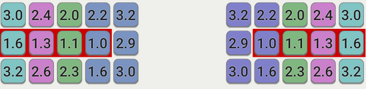

# A Combinatorial Optimization Approach to Keyboard Layout Design

## Introduction

[QWERTY](https://en.wikipedia.org/wiki/QWERTY) has been by far the most popular keyboard layout in the world. However, it was not optimized for typing English. Several key placements are clearly suboptimal. For example, "j" is placed in the home position of right index finger, one of the most comfortable positions, yet "j" is the least used key in English texts. 

A lot of alternative keyboard layouts have been designed in the past 150 years since [QWERTY](https://en.wikipedia.org/wiki/QWERTY) was created. The most popular ones are [Drovak](https://en.wikipedia.org/wiki/Dvorak_keyboard_layout) and [Colemak](https://en.wikipedia.org/wiki/Colemak). Many of those alternative layouts are designed for a more comfortable English typing experience. However, they were mostly designed manually and there were very few quantitative or automatic approaches to this problem.

In this note, we provide a combinatorial algorithm for designing keyboard layouts optimized for English texts. We collect real text frequency data using publicly available books from [Project Gutenberg](https://www.gutenberg.org/), and optimized a quantitative objective with the following two goals in mind:

(1) The more frequently used keys should be closer to the home positions and pressed using stronger fingers.

(2) Alternating the fingers as much as possible (i.e. avoid typing two consecutive keys using the same finger).

## Notations and Preliminaries

We assume the keyboard has $n$ keys, indexed by $\{0, 1, ..., n-1\}$. An alphabet $\alpha$ of $n$ keys are required to be placed on the keyboard. For our purpose, we are interested in a setting where $n=31$: the keyboard is in a 10x3 matrix format, with an additional space key that is fixed, and the alphabet is $\alpha$ = "abcdefghijklmnopqrstuvwxyz,./' ". Denote the text by a string $s$ with length $L$, which may contain characters from $\alpha$. For simplicity, we assume the first character and the last character of $s$ are both space characters. 

A keyboard layout $\pi$ is a permutation from $\{0, 1, ..., n-1\}$ to $\{0, 1, ..., n-1\}$.  $\pi(i) = j$ means that the character $\alpha[i]$ is assigned to the $j$-th key on the keyboard. Our goal is to find a keyboard layout $\pi$ that types the text $s$ most easily, based on certain quantitative criteria.


```python
# required packages:
import os
import pandas as pd
import numpy as np
from scipy.optimize import quadratic_assignment
alphabet="abcdefghijklmnopqrstuvwxyz,./' "
```

## Effort Model

We introduce a simple model for quantifying the difficulty of typing a given text. This model was inspired by (and simplified from) the analysis in [Colemak-DH](https://colemakmods.github.io/mod-dh/compare.html).

Define the total effort for typing $s$ by:

$\text{TotalEffort}(\pi, s) = \frac{1}{m_1}\sum_{i=0}^{L-1} \text{BaseEffort}(\pi(s[i])) +\frac{1}{m_2}\sum_{i=0}^{L-2} \text{Penalty}(\pi(s[i]), \pi(s[i+1])). $

Here, $m_1$ is the number of characters that is not a space key, and $m_2$ is the number of bigrams $(s[i], s[i+1])$ such that neither of them is a space key.

This effort model has two components: BaseEffort and Penalty. From a high level, BaseEffort encourages the more frequently used keys to be closer to the home positions / pressed using stronger fingers; Penalty discourages pressing two consecutive keys using the same finger.

The definitions of these two components are both slight variants from [Colemak-DH](https://colemakmods.github.io/mod-dh/compare.html). However, [Colemak-DH](https://colemakmods.github.io/mod-dh/compare.html) did not provide any algorithmic way to optimize their objective. To our best knowledge, all of the attempts to improve Colemak on the Colemak forum, has been done manually.

### Base Effort Grid
This is a measurement of the difficulty to press each key on the keyboard. See [Here](https://colemakmods.github.io/mod-dh/model.html) for details. For mathematical convenience, we also introduce an extra "space" key which has zero effort to press.



### Same Finger Bigram Penalty
Recall that Penalty discourages pressing two consecutive keys using the same finger. We let $\text{Penalty}(i, j) >0$ if and only if the $i$-th and $j$-th keys are pressed using the same finger. The "space" key is not counted towards the penalty.

Specifically, when $i$ and $j$ are pressed using the same finger, $\text{Penalty}(i, j)= 2.5$ if they are on the same row, $\text{Penalty}(i, j)= 3$ if they are one row apart from each other, and $\text{Penalty}(i, j)= 4$ if they are two rows apart from each other.

We note that the scoring values chosen in Penalty and BaseEffort are highly subjective, as noted by the author of [Colemak-DH](https://colemakmods.github.io/mod-dh/compare.html). We decided to use their scoring values as is, for two reasons: (1) designing the scoring system is not the focus of this project; (2) the author has put some quite significant effort to design the system, which has also been accepted by the Colemak users community. Our algorithmic approach generalizes to other choice of the scoring system in a straightforward manner.


```python
def load_config(kb="matrix30"):
    # load the config of keyboard layout
    if kb == "matrix30": # 10x3 matrix keyboard
        # Total number of keys, the additional key is a space key
        num_keys = 30 +1 
        num_rows = 3 # number of rows on the keyboard
        keys_to_ignore = "" # the characters to be ignored in the text
        effort_grid = [3.0, 2.4, 2.0, 2.2, 3.2,   3.2, 2.2, 2.0, 2.4, 3.0, 
                       1.6, 1.3, 1.1, 1.0, 2.9,   2.9, 1.0, 1.1, 1.3, 1.6,
                       3.2, 2.6, 2.3, 1.6, 3.0,   3.0, 1.6, 2.3, 2.6, 3.2,
                      0] 
        # for each key, specify which finger is used to type this key
        finger = [0,1,2,3,3, 6,6,7,8,9, 
                  0,1,2,3,3, 6,6,7,8,9, 
                  0,1,2,3,3, 6,6,7,8,9,
                  5]
        # for each key, specify which row is it on the keyboard
        row = [0,0,0,0,0,0,0,0,0,0,
               1,1,1,1,1,1,1,1,1,1,
               2,2,2,2,2,2,2,2,2,2,
               2]
        # same finger bigram penalty
        sfb_pen = [2.5,3,4]
    return num_keys,num_rows,keys_to_ignore,effort_grid,finger,row,sfb_pen

def compute_effort_matices(num_keys,effort_grid,finger,row,sfb_pen):  
    # compute base_effort[i][j] , same_finger[i][j] and penalty[i][j]
    base_effort_matrix = np.zeros([num_keys,num_keys])
    same_finger_bigram_matrix = np.zeros([num_keys,num_keys])
    penalty_matrix = np.zeros([num_keys,num_keys])
    
    for i in range(num_keys):
        for j in range(num_keys):
            base_effort_matrix[i][j] = (effort_grid[i] + effort_grid[j])/2
            # the special case for space
            if finger[i] == 5: 
                base_effort_matrix[i][j] = effort_grid[j]
            if finger[j] == 5:
                base_effort_matrix[i][j] = effort_grid[i]
            row_diff = np.abs(row[i] - row[j])
            if finger[i] == finger[j]:
                if i != j:
                    same_finger_bigram_matrix[i][j] = 1
                    penalty_matrix[i][j] = sfb_pen[row_diff]
    return base_effort_matrix, same_finger_bigram_matrix, penalty_matrix
```

## An Efficient Combinatorial Optimization Approach

In this section we show how the proposed objective can be formulated as a [Quadratic Assignment Problem](https://en.wikipedia.org/wiki/Quadratic_assignment_problem), which leads to efficient optimization.

Since we assumed $s[0] = s[L-1] = "~"$ which does not count toward Base Effort or Penalty, we have:
$$ \begin{align*}
\text{TotalEffort}(\pi, s) &= \frac{1}{m_1}\sum_{0 \le i \le L-1} \text{BaseEffort}(\pi(s[i])) +\frac{1}{m_2}\sum_{0 \le i \le L-2} \text{Penalty}(\pi(s[i]), \pi(s[i+1]))\\
&= \sum_{i=0}^{L-2} \frac{1}{2m_1}(\text{BaseEffort}(\pi(s[i])) + \text{BaseEffort}(\pi(s[i+1]))) + \frac{1}{m_2}\text{Penalty}(\pi(s[i]), \pi(s[i+1]))
\end{align*}
$$
For any given letter pair $(c, c')\in \alpha \times \alpha$, let $N(c,c', s)$ be the number of indices $i$ in $s$ such that $(s[i],s[i+1]) = (c, c')$. Now the equation simplifies to:
$$ \begin{align*}
\text{TotalEffort}(\pi, s) 
&= \sum_{i=0}^{L-2} \frac{1}{2m_1}(\text{BaseEffort}(\pi(s[i])) + \text{BaseEffort}(\pi(s[i+1]))) + \frac{1}{m_2}\text{Penalty}(\pi(s[i]), \pi(s[i+1])) \\
&= \sum_{c, c' \in \alpha} N(c,c', s) \cdot \left(\frac{1}{2m_1}(\text{BaseEffort}(\pi(c)) + \text{BaseEffort}(\pi(c'))) + \frac{1}{m_2} \text{Penalty}(\pi(c), \pi(c')) \right)
\end{align*}
$$
Denote 
$$\text{Cost}(a,b) = \frac{1}{2m_1}(\text{BaseEffort}(a) + \text{BaseEffort}(b)) + \frac{1}{m_2}\text{Penalty}(a,b) $$
Now we have a simple expression for the TotalEffort:
$$\text{TotalEffort}(\pi, s)  = \sum_{0 \le i, j < n} N(\alpha[i],\alpha[j], s) \cdot \text{Cost}(\pi(i), \pi(j))$$

This is an instance of [Quadratic Assignment Problem](https://en.wikipedia.org/wiki/Quadratic_assignment_problem). Here, the problem is to find a bijection $\pi: P \rightarrow P$, s.t. $\sum_{a, b \in P} w_{a,b} d(\pi(a),\pi(b))$ is minimized. 

It is exactly the definition of TotalEffort if we choose
$P = \{0,  1, ..., n-1\}$, $w_{i,j} =N(\alpha[i],\alpha[j], s) $ and $d(\pi(a),\pi(b)) = \text{Cost}(a, b)$.


```python
def char_to_int(c): 
    # return i iff alphabet[i] == c, otherwise treat it as a space key
    char_to_id = dict(zip(alphabet,list(range(len(alphabet))) ))
    return char_to_id[c] if c in alphabet else num_keys-1

def compute_bigram_freq(keys_to_ignore):
    # compute the letter frequency. 
    # bigram_matrix[i][j] = N(alpha[i], alpha[j], s)
    df_bigrams = pd.read_csv(os.path.join(os.path.dirname(os.path.realpath('__file__')), 'stats.csv'), header=0, sep=',', index_col=0)
    bigram_matrix = np.zeros([num_keys,num_keys])
    df_bigrams = df_bigrams / df_bigrams.sum(axis=0)
    # ignore keys
    for c in keys_to_ignore:
        alphabet=alphabet.replace(c, "")
    for key in df_bigrams['books'].keys():
        i = char_to_int(key[0])
        j = char_to_int(key[1])
        bigram_matrix[i][j] += df_bigrams['books'][key]
    # count total unigram/bigrams
    total_nonspace_unigram = 1 - bigram_matrix[num_keys-1][num_keys-1]
    total_nonspace_bigram = 1 - np.sum(bigram_matrix,0)[num_keys-1] - np.sum(bigram_matrix,1)[num_keys-1] + bigram_matrix[num_keys-1][num_keys-1]
    return bigram_matrix, total_nonspace_unigram , total_nonspace_bigram

def print_layout(perm, show = True): 
    # print the layout in a nice looking way
    ans = ""
    disp = ["" for i in range(num_rows)]
    for i in range(num_keys):
        c = alphabet[perm[i]]
        row_c = row[i]
        ans= ans + c 
        disp[row_c] = disp[row_c] + c + ' '
    if show:
        for i in range(num_rows):
            print(disp[i])
    return ans

def permute_matrix(p):
    # turns a permutation into corresponding permutation matrix
    P = np.zeros([num_keys,num_keys])
    for i in range(num_keys):
        P[i][p[i]] = 1
    return P
def layout_to_perm(s):
    #turns a layout into corresponding permutation pi
    ans = np.zeros(num_keys, dtype= np.int8)
    for i in range(num_keys):
        ans[i] = char_to_int(s[i])
    return ans

```


```python
# initialize all of the quantities required
num_keys,num_rows,keys_to_ignore,effort_grid,finger,row,sfb_pen =  load_config()
base_effort_matrix, same_finger_bigram_matrix, penalty_matrix = compute_effort_matices(num_keys,effort_grid,finger,row,sfb_pen)
bigram_matrix, total_nonspace_unigram , total_nonspace_bigram  = compute_bigram_freq(keys_to_ignore)
coeff_matrix = base_effort_matrix/total_nonspace_unigram + penalty_matrix/ total_nonspace_bigram
```

# Optimization
While [Quadratic Assignment Problem](https://en.wikipedia.org/wiki/Quadratic_assignment_problem) is NP-Hard in general, scipy has provided a very efficient optimization algorithm for it. This algorithm is based on a first order (gradient-descent-like) algorithm over a continuous relaxation of the objective, followed by a greedy combinatorial local swap step. With a few thousands of random initializations, our algorithm runs in seconds on a 10-year-old Intel Core i7 2600 desktop.

The algorithm also supports fixing some of the key placements. This is very useful since it is desirable to keep some of the punctuation keys or common shortcuts in the original place, like ctrl-a, ctrl-q, ctrl-c, ctrl-v, etc.

Here we generate a few candidate layouts based on different levels of constraint: one with fixed qwazxcv and punctuations (like colemak), one with fixed qwazxc and punctuations (like colemak-dh), fixed punctuations only, or no constraints at all.


```python
def search_layout(fixed, n_rand_init):
    # fixed: the fixed assignment of keys
    # n_rand_init: number of random initializations in the optimization step
    # process the constraints
    for i in range(len(fixed)):
        fixed[i][1] = char_to_int(fixed[i][1])
    fixed.append([num_keys - 1, num_keys - 1])
    fixed.sort()
    # step 1: optimize with random initialization and grad descent on continuous relaxation
    options1 = {"P0": "randomized", "partial_match": fixed}
    sol = min([quadratic_assignment(coeff_matrix, bigram_matrix, options=options1) for i in range(n_rand_init)], key=lambda x: x.fun)
    # step 2: optimize with greedy swaps
    options2 = {"partial_guess": np.array([np.arange(num_keys), sol.col_ind]).T, "partial_match":fixed}
    sol = quadratic_assignment(coeff_matrix, bigram_matrix, method="2opt", options=options2)
    layout = print_layout(sol.col_ind,show = True)
    return layout
#generate layouts
fixed_qwazxc =[[0,'q'] ,
        [1,'w'],
        [9,'\''],
        [10,'a'],
        [13,'t'],
        [20,'z'],
        [21,'x'], 
        [22,'c'],
        [27, ','],
        [28, '.'],
        [29, '/']]
fixed_qwazxcv =[[0,'q'] ,
        [1,'w'],
        [9,'\''],
        [10,'a'],
        [13,'t'],
        [20,'z'],
        [21,'x'], 
        [22,'c'],
        [23,'v'],
        [27, ','],
        [28, '.'],
        [29, '/']]
fixed_punc =[ [9,'\''],
        [27, ','],
        [28, '.'],
        [29, '/']]
fixed_none =[]
n_rand_init = 1000
print("generated with fixed qwazxcv and punctuations:")
layout_qwazxcv = search_layout(fixed_qwazxcv, n_rand_init)
print("generated with fixed qwazxc and punctuations:")
layout_qwazxc = search_layout(fixed_qwazxc, n_rand_init)
print("generated with fixed punctuations only:")
layout_punc = search_layout(fixed_punc, n_rand_init)
print("generated with no restrictions:")
layout_none = search_layout(fixed_none, n_rand_init)
```

    generated with fixed qwazxcv and punctuations:
    q w l d k j f u y ' 
    a r s t m b n e i o 
    z x c v g p h , . /   
    generated with fixed qwazxc and punctuations:
    q w l m k j f u y ' 
    a r s t g b n e i o 
    z x c d v p h , . /   
    generated with fixed punctuations only:
    x c l f z j m u y ' 
    a s r n b k t e i o 
    q g w h p v d , . /   
    generated with no restrictions:
    v f u , q z w l c y 
    r n e a . b t h s i 
    x p ' o / k d m g j   
    

# Evaluation
We compare our algorithmically generated layouts with existing manually designed ones, including [QWERTY](https://en.wikipedia.org/wiki/QWERTY), [Drovak](https://en.wikipedia.org/wiki/Dvorak_keyboard_layout), [Colemak](https://en.wikipedia.org/wiki/Colemak) and more. 

These comparisons are based on our total effort, base effort, penalty scores and same finger bigram percentage (i.e. how often is it needed to press two consecutive keys with the same finger).


```python
def evaluate(layout, print_score = True):
    # evaluate the layout based on score function, base effort, penalty and same_finger_bigrams
    perm = layout_to_perm(layout)
    P = permute_matrix(perm)
    penalty = np.trace(penalty_matrix.T @ P @ bigram_matrix @ P.T) / total_nonspace_bigram
    base_effort = np.trace(base_effort_matrix.T @ P @ bigram_matrix @ P.T) /total_nonspace_unigram
    overall_score = base_effort + penalty
    sfb = np.trace(same_finger_bigram_matrix.T @ P @ bigram_matrix @ P.T) / total_nonspace_bigram * 100
    if print_score:
        print('score:', overall_score)
        print('same_finger_bigram:', sfb, "%")
        print('base effort:', base_effort)
        print('penalty:', penalty)
    return [overall_score, sfb,base_effort,penalty]
```


```python
# print and evaluate the candidate layouts
layouts = [["qwerty",      "qwertyuiopasdfghjkl'zxcvbnm,./ "],
           ["colemak-dh",  "qwfpbjluy'arstgmneiozxcdvkh,./ "],
           ["colemak",     "qwfpgjluy'arstdhneiozxcvbkm,./ "],
           ["drovak",      "',.pyfgcrlaoeuidhtns/qjkxbmwvz "],
           ["handsdown",   "qchpvkyoj'rsntgwueiaxmldbzf,./ "],
           ["soul",        "qwldpkmuy'asrtgfneiozxcvjbh,./ "],
           ["aset",        "qwjfgypul'asetdhniorzxcvbkm,./ "],
           ["minimak8 ",   "qwdrkyuilpastfghneo'zxcvbjm,./ "],
           ["ours-qwazxcv", layout_qwazxcv],
           ["ours-qwazxc",  layout_qwazxc],
           ["ours-punct",    layout_punc],
           ["ours-none",    layout_none]]
for i in range(len(layouts)):
    layouts[i] = layouts[i]  + evaluate(layouts[i][1], print_score = False)
layouts.sort(key = lambda x: x[2])
for i in range(len(layouts)):
    print("rank",i, ":",layouts[i][0], layouts[i][2])
    print_layout(layout_to_perm(layouts[i][1]))
    print("-------------------")
df = pd.DataFrame(layouts, columns =['name', 'layout', 'totaleffort', 'same_finger_bigram', 'base', 'penalty'])
df
```

    rank 0 : ours-none 1.6589118258928328
    v f u , q z w l c y 
    r n e a . b t h s i 
    x p ' o / k d m g j   
    -------------------
    rank 1 : ours-punct 1.6801091955890144
    x c l f z j m u y ' 
    a s r n b k t e i o 
    q g w h p v d , . /   
    -------------------
    rank 2 : ours-qwazxc 1.6905006857296292
    q w l m k j f u y ' 
    a r s t g b n e i o 
    z x c d v p h , . /   
    -------------------
    rank 3 : colemak-dh 1.704741478170455
    q w f p b j l u y ' 
    a r s t g m n e i o 
    z x c d v k h , . /   
    -------------------
    rank 4 : ours-qwazxcv 1.728803412528172
    q w l d k j f u y ' 
    a r s t m b n e i o 
    z x c v g p h , . /   
    -------------------
    rank 5 : soul 1.7423222997847656
    q w l d p k m u y ' 
    a s r t g f n e i o 
    z x c v j b h , . /   
    -------------------
    rank 6 : handsdown 1.7542377505320454
    q c h p v k y o j ' 
    r s n t g w u e i a 
    x m l d b z f , . /   
    -------------------
    rank 7 : colemak 1.7987685793082813
    q w f p g j l u y ' 
    a r s t d h n e i o 
    z x c v b k m , . /   
    -------------------
    rank 8 : aset 1.8667974476688138
    q w j f g y p u l ' 
    a s e t d h n i o r 
    z x c v b k m , . /   
    -------------------
    rank 9 : minimak8  1.923265759408603
    q w d r k y u i l p 
    a s t f g h n e o ' 
    z x c v b j m , . /   
    -------------------
    rank 10 : drovak 1.9248213849510105
    ' , . p y f g c r l 
    a o e u i d h t n s 
    / q j k x b m w v z   
    -------------------
    rank 11 : qwerty 2.401630225079672
    q w e r t y u i o p 
    a s d f g h j k l ' 
    z x c v b n m , . /   
    -------------------
    


<div>
<table border="1" class="dataframe">
  <thead>
    <tr style="text-align: right;">
      <th></th>
      <th>name</th>
      <th>layout</th>
      <th>totaleffort</th>
      <th>same_finger_bigram</th>
      <th>base</th>
      <th>penalty</th>
    </tr>
  </thead>
  <tbody>
    <tr>
      <th>0</th>
      <td>ours-none</td>
      <td>vfu,qzwlcyrnea.bthsixp'o/kdmgj</td>
      <td>1.658912</td>
      <td>0.905721</td>
      <td>1.630558</td>
      <td>0.028353</td>
    </tr>
    <tr>
      <th>1</th>
      <td>ours-punct</td>
      <td>xclfzjmuy'asrnbkteioqgwhpvd,./</td>
      <td>1.680109</td>
      <td>1.403423</td>
      <td>1.635438</td>
      <td>0.044672</td>
    </tr>
    <tr>
      <th>2</th>
      <td>ours-qwazxc</td>
      <td>qwlmkjfuy'arstgbneiozxcdvph,./</td>
      <td>1.690501</td>
      <td>1.541221</td>
      <td>1.640971</td>
      <td>0.049530</td>
    </tr>
    <tr>
      <th>3</th>
      <td>colemak-dh</td>
      <td>qwfpbjluy'arstgmneiozxcdvkh,./</td>
      <td>1.704741</td>
      <td>1.631484</td>
      <td>1.653080</td>
      <td>0.051661</td>
    </tr>
    <tr>
      <th>4</th>
      <td>ours-qwazxcv</td>
      <td>qwldkjfuy'arstmbneiozxcvgph,./</td>
      <td>1.728803</td>
      <td>1.541221</td>
      <td>1.679006</td>
      <td>0.049798</td>
    </tr>
    <tr>
      <th>5</th>
      <td>soul</td>
      <td>qwldpkmuy'asrtgfneiozxcvjbh,./</td>
      <td>1.742322</td>
      <td>1.888932</td>
      <td>1.681498</td>
      <td>0.060824</td>
    </tr>
    <tr>
      <th>6</th>
      <td>handsdown</td>
      <td>qchpvkyoj'rsntgwueiaxmldbzf,./</td>
      <td>1.754238</td>
      <td>1.398541</td>
      <td>1.710238</td>
      <td>0.044000</td>
    </tr>
    <tr>
      <th>7</th>
      <td>colemak</td>
      <td>qwfpgjluy'arstdhneiozxcvbkm,./</td>
      <td>1.798769</td>
      <td>1.631484</td>
      <td>1.746691</td>
      <td>0.052077</td>
    </tr>
    <tr>
      <th>8</th>
      <td>aset</td>
      <td>qwjfgypul'asetdhniorzxcvbkm,./</td>
      <td>1.866797</td>
      <td>3.064345</td>
      <td>1.769551</td>
      <td>0.097247</td>
    </tr>
    <tr>
      <th>9</th>
      <td>minimak8</td>
      <td>qwdrkyuilpastfghneo'zxcvbjm,./</td>
      <td>1.923266</td>
      <td>4.090840</td>
      <td>1.793553</td>
      <td>0.129712</td>
    </tr>
    <tr>
      <th>10</th>
      <td>drovak</td>
      <td>',.pyfgcrlaoeuidhtns/qjkxbmwvz</td>
      <td>1.924821</td>
      <td>2.665626</td>
      <td>1.843624</td>
      <td>0.081197</td>
    </tr>
    <tr>
      <th>11</th>
      <td>qwerty</td>
      <td>qwertyuiopasdfghjkl'zxcvbnm,./</td>
      <td>2.401630</td>
      <td>6.588611</td>
      <td>2.186692</td>
      <td>0.214938</td>
    </tr>
  </tbody>
</table>
</div>


# Conclusion
From the above comparison, we can see that our algorithmically generated layouts scores better than almost all of the manually designed layouts. We can see that in our score model, colemak-dh is a very well-designed layout (perhaps not so surprising because the scoring model we used was, for the most part, designed by the author of colemak-dh). It's only marginally worse than the algorithmically generated layout ours-qwazxc, and better than ours-qwazxcv (which has one extra constraint on the placement of 'v'). We also note that ours-qwazxc layout is extremely similar to colemak-dh: they are only different on 6 key assignments, mostly infrequently used ones. All layouts improved over QWERTY by a very big margin.
